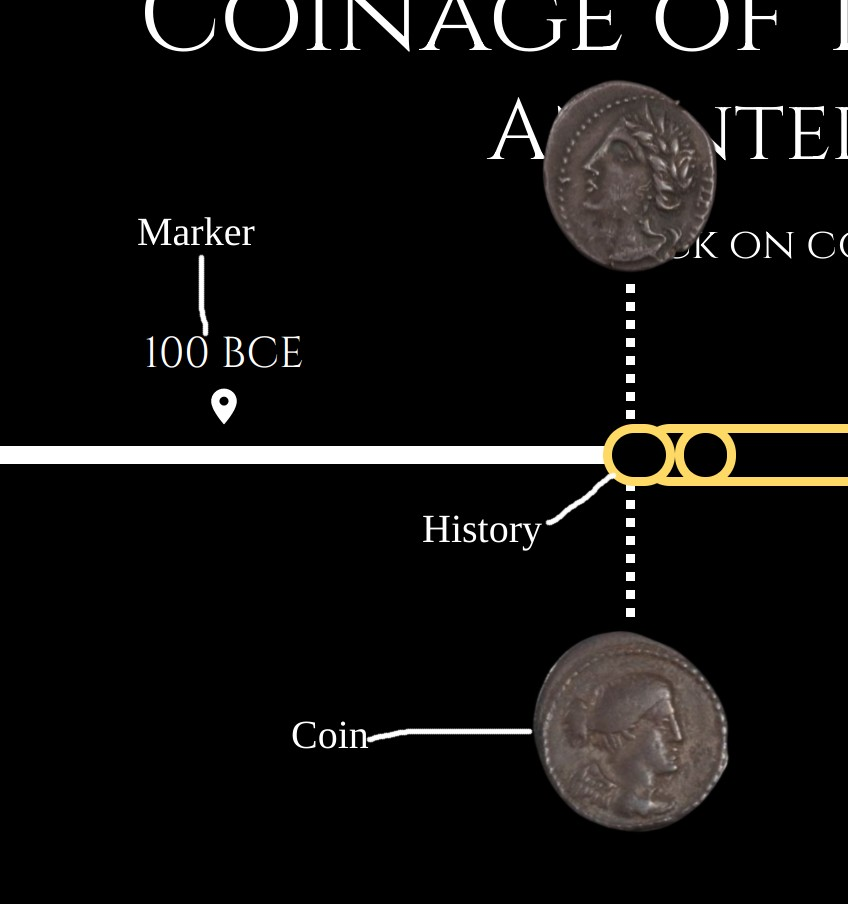

# Coinage of the roman republic
Coinage of the roman repulic is a chronological timeline tool that presents visual and textual information on  
different roman coins from different times. The app is built with react js and uses data researched from 
different books.

## Demo link
Access the site here on [github](https://hileamlakb.github.io/coinage-history/)

## Table of Content

- [Coinage of the roman republic](#coinage-of-the-roman-republic)
  - [Demo link](#demo-link)
  - [Table of Content](#table-of-content)
  - [About The App](#about-the-app)
  - [Screen shots](#screen-shots)
  - [Technologies](#technologies)
  - [Getting started with this repo](#getting-started-with-this-repo)
  - [Setup](#setup)
  - [Credits](#credits)

## About The App

Coinage of the roman repulic is a chronological timeline tool that presents visual and textual information on  
different roman coins from different times. The app is built with react js and uses data researched from 
different books.

The app is targated for bigger screens like tablets and laptops.

## Screen shots

Most of the advancment in coins appear in the late eras, so you will have to scroll a bit to the right before
you start seeing anything intersting.

## Technologies
This project uses react-js, material-ui, and google-fonts for rendring the ui.
It also uses python to parse data from csv format to a javascript object in the form of json.

## Getting started with this repo
If you want to work on this project, here is a quick guid on how it is setup. 

1. In the [Tool](./Tool/) folder you have the python script that changes the csv to json.
The CSV file must have some required headers, which you can look at the sample [file](./Tool/timelinecontent.csv)
One thing to note here is the name of the coin-images. The convention used is explained in the script. Also you can look at [this](./Tool/img_namer.ipynb) to see how the image names are generated. The images should then be located in 
the [./public/assets/images/](./public/assets/images/) folder.

2. On rending the UI side, you have the main app that fetches the data and creats the differnt type of events. To be
   specific, there are three types of events.

   The markers, the history events and the coin events. 
   

   The component for each of this can be found in [App.js](./src/App.js); the code here is self explanatory. Helper components for these are found in the [componnet.js](./src/components.js) file.

   Each component are positioned in the timeline depending on the events starting period using css's absolute position 
   property. 

## Setup
- Download or clone the repository
- Run `npm install`
- and start hacking

## Credits
List of contriubutors:
- [Andrew Zhang](@asparte)
- [Hileamlak Yitayew](@hileamlakb)

